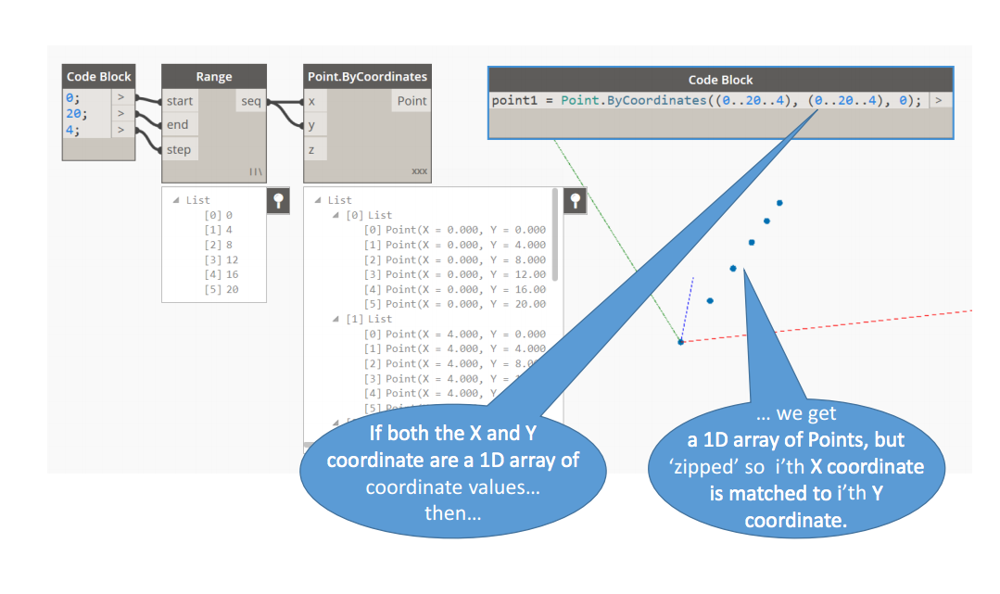

# more bentobots tests

currently the following are installed locally using `npm link bentobots` etc

```
  Bot = require('bentobots').Bot,
  Graph = require('bentobots').Graph,
  list = require('bentobots-list'),
  utils = require('bentobots-utils'),
  point = require('bentobots-point')
```

## Running examples

`node index.js` is based on the example below, taken from [http://designscript.io/Annotated_DesignScript_presentation_from_DSM_2016.pdf](http://designscript.io/Annotated_DesignScript_presentation_from_DSM_2016.pdf)


